# RetinaFace : Single-stage Dense Face Localisation in the wild
## 논문 리뷰
- Abstract
    - Retina Face 특징
         - 강직한 single-stage 기법의 face detector
         - pixel-wise 연산을 통해서 localization 수행
         - 다양한 크기의 face에 대해서 joint extra-supervised & self-supervised multi task 학습을 통해 이점을 얻음 
    - Retina Face contribution
        - 5개의 landmark를 WIDER FACE dataset에 찍고, extra supervision을 통해서 hard face detection의 성능 향상
        - pixel-wise 3D face shape를 예측하기 위해서 supervised mesh decoder branch 를 추가
        - WIDER FACE dataset의 hard test에 대해서 AP를 향상 시킴
        - ArcFAce를 적용하여 더욱 성능을 향상시킴
        - weight가 작은 backbone을 사용하여 CPU에서 구현할 수 있는 모델을 설계
1. Introduction
    - 자동으로 얼굴의 위치를 찾는 것은 face 이미지 분석을 위한 여러 application 에서 필수 과정
    - 좁은 의미의 face localization(=전통적인 face localization) : face bounding box를 scale 과 position을 고려하지 않고 계산함
    - 넓은 의미의 face localization : face detection, face alignment, pixel-wise face parsing, 3D dense correspondence regression 포함
        - 이러한 깊은 face localization은 서로 다른 크기의 face에 대해서도 정확한 position을 찾을 수 있음
    - 기존의 Object Detection에 비해 face detection은 더 작은 변화율(약 1:1 ~ 1:1.5)를 갖지만, 훨씬 큰 scale 변화율을 가짐(거의 수 pixels ~ 몇 천 pixel)
    - 가장 최근 sota 방식은 "깊은 face localization", "feature 피라미드의 scale", "유망한 동작에 대한 입증", "two-stage 방식에 비해 빠른 속도"의 특징을 갖는 single-stage 방식에 더욱 집중되어있음
    - 이러한 경향에 따라서 본 논문도 single-stage 방식을 진화시켰으며, supervised 및 self-supervised 에 의한 multi-task loss를 구하고 이를 토대로 dense face localization하는 방식을 적용  
    - 기존의 Face Detection 변천사
        - 전형적인 face detection은 분류와 box regression을 모두 포함  
        1. MTCNN & STN
            - face 와 face landmark를 동시에 검출
            - train data의 제한으로 인해서 JDA, MTCNN, STN은 작은 face 검출이 5개의 face landmark에 대해서 extra super vision이 이득을 가져다 주는지 검증하지 않았음
        1. Mask R-CNN
            - 예측 branch 와 bounding box regression + recognition branch를 병렬로 연결하여 상당한 성능 향상을 이룸
            - 즉, 깊은 pixel-wise annotation은 검출 성능을 높여줌
            - 불행히도 WIDER FACE dataset은 dense face annotation이 불가능했음
            - supervised signal이 쉽게 얻어지기 않았기 때문에 문제는 unsupervise 방식의 적용 가능 여부였음
        1. FAN : anchor-level attention map
            - 성능 향상이 제한된 face detection을 개선하기 위해서 제안되었지만, attention map 은 꽤 조잡했고, semantic 정보를 포함하지 않았음
        1. 최근의 self-supervise 3D morphable 모델들
            - 유망한 3D face 모델링 성과를 냈음
            - 특히, Mesh Decoder, real-time speed(joint shape에서 graph conv 적용)
            - <u>그러나,</u> Mesh Decoder를 single-stage에 적용하는 것은 "camera 파라미터의 정확도 평가 어려움", "감춰진 joint shape 와 texture representation이 single feature 벡터에 의해서 예측" 되는 이유로 인해서 어려움이 따름
            - 본 논문에서는 mesh decoder branch를 <u>pixel-wise 3D face shape 예측을 위한 self-supervision 학습</u>을 통해서 mesh decoder를 supervised branch 와 병렬로 적용   
1. Related Work
    1. Image pyramid vs Feature pyramid
        - Image pymaid 방식은 sliding window로부터 구해지며, 밀집된 image gird에 적용됨
        - 이 방식은 "실시간 효율", "크기가 고정된 image에 대한 광범위한 적용" 등의 이유로 detection paradigm을 주도했음  
        - 그러나 sliding-anchor 방식은 크기가 다양한 feature map에 적용 가능하다는 점 때문에 <u>빠른 속도로 face detection 분야를 주도함</u>  
    1. Two stage vs Single stage
        - Two stage 방식은 "proposal" 과 "refinement" 메커니즘에 의해서 높은 localization 정확도를 가짐  
        - 반면, Single stage 방식은 train 동안 발생한 positive sample 과 negative sample 사이의 불균형에서 빽빽하게 face location 과 scale 을 빽빽하게 샘플링 함
        - 이러한 불균형을 다루기 위해서 sampling & re-weighting 방식이 널리 적용되었음
        - 따라서 two stage에 비해서 single stage 방식은 더욱 효율적이며, 높은 재현률을 가짐
        - 그러나, 높은 거짓 positive rate 와 localization 정확도의 절충의 리스크가 있음  
    1. Context Modelling
        - 작은 얼굴에 대해서 모델의 contextual 추론을 강화하기 위해서, SSH 와 PyramidBox 에서는 context 모듈을 적용하여 유클리디안 좌표에서 feature pyramid 의 reception field를 키우려 하였음
        - CNN의 non-rigid transformation modelling을 강화하기 위해서 DCN(Deformable Conv Network)에서는 새로운 deformable layer를 모델의 기하학적 변환에 적용함  
    1. Multi-task Learning
        - Joint face detection 과 alignment는 aligned face가 face classification 에서 더 좋은 특징을 제공함에도 불구하고, 널리 사용되었다
        - Mask R-CNN에서 detection 성능은 object mask를 예측하는 branch를 추가한 결과 상당히 성능이 향상되었다
        - DensePose 에서 dense part label과 선택된 각 영역의 좌표를 얻기 위해서 Mask R-CNN의 구조를 적용했음에도 불구하고, Dense regression branch 는 supervised learning에 의해서 train되었다
        - 또한, dense branch 는 small FCN이며, 각 RoI의 pixel-to-pixel dense mapping을 예측하기 위해서 적용되었음   
1. RetinaFace
    1. Multi-task Loss
        - 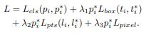 의 값을 최소로 해야함  
        - classification loss 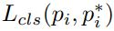 에서 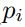 는 i번째 anchor가 face일 확률이고, 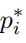 는 positive anchor면 1, negative anchor면 0의 값을 가짐
        - 따라서 classification loss  는 Face or Not Face 의 2진 분류기(softmax)임  
        - 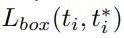 에서 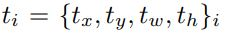 는 positive anchor에 대해서 예측 box의 좌표를, 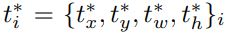는 ground truth box의 좌표를 의미
        - 이어서 "Fast R-CNN"에 따라 center location, width, height 등 regression targets 를 normalize 했고, 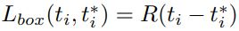를 사용  R은 "Fast R-CNN"에서 정의했던 강직한 loss function(smooth-L1)임  
        - Facial landmark regression loss 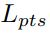 에서 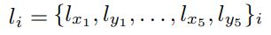 는 5개 landmark에 대한 예측 확률을 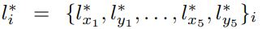 는 ground-truth 에 대한 positive anchor 값을 나타냄
        - box center regression과 유사하게 anchor의 center에 대해 target mormalization을 적용  
        - Dense regression loss 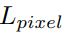 에서 loss-balancing parameter 인 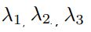 은 각각 0.25, 0.1, 0.01 로 설정
        - 즉, supervision signal로부터 더 중요한 better box 와 landmark location을 증가시키기 위함   
    1. Dense regression Branch
        - __Mesh Decoder__
            - "Dense 3d face decoding over 2500fps"에서 제시된 __graph convolution__ 방식을 적용
            - 또한 <u>더 빠른 속도</u>를 위해서 "Dense 3d face decoding over 2500fps" 처럼 __joint shape decoder__ & __texture decoder__ 도 적용  
            - 2D convolution vs graph convolution
                - 2D convolution  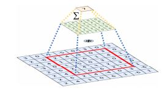  
                - 유클리디안 좌표에서의 kernel-weighted neighbour sum  
                - graph convolution  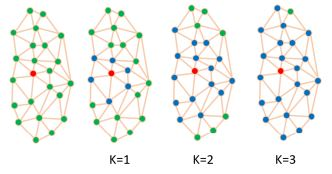  
                - 2d conv 와 동일하게 유클리디안 좌표에서 거리에 따른 가중치 합이지만, neighbour distance 는 graph 내에서 edge들 사이의 2개의 vertice로 구성된 최소의 갯수로부터 계산됨  
            - "Dense 3d face decoding over 2500fps"에 따라 face mesh 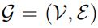를 정의
                - 이때의 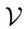 는 face shape 와 texture information을 포하하는 vertex 이며, 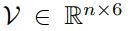
                - 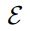 은 vertex 사이의 거의 인접하지 않은 연결을 행렬로 표현한 값이며, 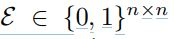
                - graph Laplacian 은  로 정의되고, 그때 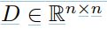 는 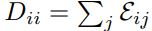 의 대각행렬
                - graph convolution 은 "Chebyshev 다항식"에서 K 값에서 표현한 것으로 표현할 수 있으므로 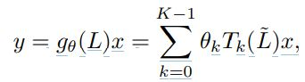  
                - ~~이후의 설명은 어려워서 모르겠음...~~    
            - Differentiable Renderer
                - shape 와 texture 에 대한 예측에 대해서 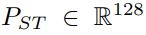 가 성립할 때, efficient differentiable 3D mesh renderer 를 적용하여, coloured mesh 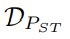 를 2D 평면상에 투영시킴
                - 이 2D image 평면에는 camera의 parameter(예를 들면 pose, focal length 등)  와 illumination parameter(예를 들면 location,light source, colour value 등) 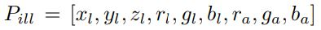 가 있음  
            - Dense Regression Loss
                - 2D face 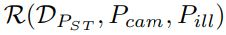 를 rendering 하자마자 pixel-wise 로 rendering 된 face와 원래의 2D face를 다음의 식을 사용해서 차이를 비교함    
                - W, H는 각각 anchor crop에서 width, heigh 를 의미   
1. Experiments
                 